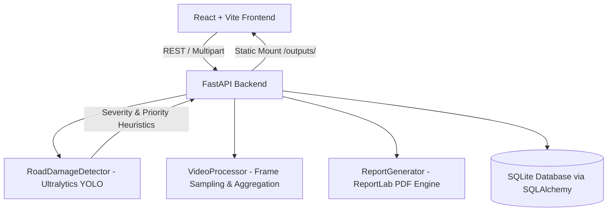

# AI RoadGuard: Pothole & Road-Damage Detection System

An end-to-end, production-grade AI/ML computer vision application designed to detect, classify, visualize, and prioritize road damage (potholes, cracks, and surface wear) from images, dashcam videos, and live camera streams.

---

## System Architecture



- **Frontend**: React 19 + Vite, custom transportation-engineering CSS design system, Lucide icons, Recharts interactive data visualizers.
- **Backend**: FastAPI, SQLAlchemy ORM, SQLite database, Pydantic V2 schemas.
- **Computer Vision & ML**: Ultralytics YOLO (PyTorch + Torchvision), OpenCV image/video rendering with distinctive class color-coding.
- **Reporting**: ReportLab PDF engine generating downloadable engineering inspection documents.

---

## Key Features

1. **Multi-Modal Inspection**:
   - **Image Analysis**: Upload `.jpg`, `.jpeg`, or `.png` road imagery for instant bounding box annotation and severity rating.
   - **Video / Dashcam Analysis**: Upload `.mp4`, `.mov`, or `.avi` road survey videos. Video processor samples frames, aggregates unique defects, computes peak hazard score, and renders an annotated video.
   - **Live Webcam / Mobile Camera**: In-browser real-time camera feed with single-frame capture and continuous auto-scan every 3.5 seconds.
2. **Defect Classification**:
   - Potholes (High-risk structural voids)
   - Longitudinal Cracks
   - Transverse Cracks
   - Alligator / Fatigue Cracking (Base layer failure)
   - Surface Damage / Weathering
3. **Engineering Severity Estimation**:
   - Classifies each detected defect into **Minor**, **Moderate**, or **Severe** based on defect type, bounding box area ratio (`bbox_area / image_area`), and detection confidence.
4. **Transparent Maintenance Priority Index (0–100)**:
   - Evaluates road hazard level using an algorithmic index weighted by hazard type (potholes x1.5, alligator cracking x1.3), severity tiers, and defect density.
   - Outputs actionable triage labels:
     - **Critical (80–100)**: Immediate emergency intervention required.
     - **High (60–79)**: Priority resurfacing within 14 days.
     - **Medium (35–59)**: Routine crack-sealing within 30–60 days.
     - **Low (0–34)**: Standard monitoring cycle.
5. **Analytics Dashboard**:
   - Aggregate statistics across all inspections: total defects, defect distribution charts, severity breakdown pie chart, and historical timeline.
6. **Downloadable Inspection PDF Reports**:
   - Official road condition reports complete with executive metrics, embedded visual evidence, bounding box coordinate tables, and engineering disclaimers.

---

## Project Structure

```
road-damage-detection/
├── backend/
│   ├── app/
│   │   ├── api/             # API routes (health, analysis, dashboard)
│   │   ├── core/            # App settings and environment configs
│   │   ├── database/        # SQLAlchemy session & ORM models
│   │   ├── models/          # Pydantic request/response schemas
│   │   ├── services/        # detector.py, video_processor.py, report_generator.py
│   │   └── utils/           # File validation & disk storage helpers
│   ├── outputs/             # Annotated images, videos, and generated PDFs
│   ├── tests/               # 14 pytest unit & integration tests
│   └── requirements.txt
├── frontend/
│   ├── src/
│   │   ├── components/      # Layout and Navigation
│   │   ├── pages/           # HomePage, AnalyzePage, DashboardPage, HistoryPage, AnalysisDetailPage
│   │   ├── services/        # Axios API wrapper (api.js)
│   │   └── index.css        # Handcrafted CSS design system
│   └── package.json
├── ml/
│   ├── configs/             # road_damage.yaml, training_config.yaml
│   ├── train.py             # YOLO fine-tuning pipeline
│   └── evaluate.py          # Validation mAP & PR metrics reporting
└── progress.md              # Detailed stage-by-stage phase tracking
```

---

## Getting Started

### 1. Backend Setup

```bash
cd backend
python -m venv venv
venv\Scripts\activate
pip install -r requirements.txt

# Run server
python -m uvicorn app.main:app --host 127.0.0.1 --port 8000
```
Backend API will be accessible at: `http://127.0.0.1:8000` (Swagger docs at `/docs`).

### 2. Frontend Setup

```bash
cd frontend
npm install
npm run dev -- --port 5173
```
Frontend web application will be accessible at: `http://127.0.0.1:5173`.

### 3. Running Automated Tests

```bash
cd backend
python -m pytest
```

---

## Machine Learning & Model Training

To train or fine-tune YOLO on the RDD2022 dataset:

```bash
cd ml
python train.py --data configs/road_damage.yaml --config configs/training_config.yaml --epochs 50
```

Trained weights will automatically be exported to `ml/weights/best.pt`. The backend detector automatically detects and loads `ml/weights/best.pt` upon startup.

To evaluate model accuracy:
```bash
python evaluate.py --weights weights/best.pt --data configs/road_damage.yaml
```

---

## Disclaimer

This system is an automated AI-based decision-support prototype. Defect boundaries, severities, and priority indices are advisory heuristics. Final road maintenance authorization, budget allocation, and repair specifications must be certified through on-site manual engineering inspection by licensed civil authorities.
